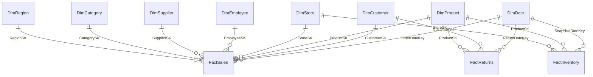

# Power BI Data Modeling — Best Practices for RetailDW

> **Project:** Enterprise Retail Analytics Platform — ShopStar Retail
> **Author:** Amit Jaiswal — Senior BI Engineer
> **Phase:** Phase 6 — Power BI Data Model
> **Audience:** A junior BI developer building their first enterprise semantic
> model. Each section explains **WHAT / WHY / HOW** with our actual tables.

---

## Table of Contents

1. [Star Schema in Power BI](#1--star-schema-in-power-bi)
2. [Cardinality](#2--cardinality)
3. [Cross-Filter Direction](#3--cross-filter-direction)
4. [Date Table Requirements](#4--date-table-requirements)
5. [Hierarchies](#5--hierarchies)
6. [Display Folders](#6--display-folders)
7. [Hide Technical Columns](#7--hide-technical-columns)
8. [Measure Table Pattern](#8--measure-table-pattern)
9. [Naming Conventions](#9--naming-conventions)
10. [Performance](#10--performance)
11. [Composite Models](#11--composite-models)
12. [Aggregation Tables](#12--aggregation-tables)
13. [Common Mistakes](#13--common-mistakes--how-to-avoid-them)

---

## 1 — Star Schema in Power BI

**WHAT:** A central **fact** table surrounded by **dimension** tables, each
joined by a single key. We already built this in SQL (`warehouse.*`).

**WHY:** The VertiPaq engine is optimized for star schemas. They give fast
queries, simple relationships, and intuitive filtering. Snowflakes and
flattened wide tables both hurt performance and usability.

**Our model relationships:**



**HOW:**
1. Import all `warehouse.*` tables (see the Power Query guide).
2. In **Model view**, create relationships fact `SK` → dimension `SK` (drag the
   fact key onto the dimension key).
3. Keep **one active relationship** per dimension→fact pair.
4. `DimDate` connects to all three facts via its date keys (a **role-playing**
   dimension — see §4).

> **Multiple date roles:** `FactReturns` has both `ReturnDateKey` and
> `OrderDateKey`. Only one relationship to `DimDate` can be **active**; use
> `USERELATIONSHIP` in a measure to activate the other when needed, or import a
> second date table (`DimReturnDate`) for a clean inactive-free model.

---

## 2 — Cardinality

**WHAT:** How rows on each side of a relationship correspond.

**WHY:** The wrong cardinality creates wrong totals or ambiguous filters.

| Cardinality | Use it for | Notes |
|-------------|-----------|-------|
| **One-to-Many (1:*)** | Dimension (1) → Fact (*) | The **default and correct** choice for every relationship in our model |
| **Many-to-One (*:1)** | Same as above, other direction | Just the mirror of 1:* |
| **One-to-One (1:1)** | Rare — splitting a wide dimension | Usually a modeling smell |
| **Many-to-Many (*:*)** | Avoid unless truly needed | Slower, ambiguous; prefer a bridge table |

**HOW:** In each relationship, the dimension side shows **1** and the fact side
shows **\***. Power BI usually auto-detects this because dimension `SK` columns
are unique keys. If it guesses `*:*`, your dimension key has duplicates — fix the
data, don't accept many-to-many.

---

## 3 — Cross-Filter Direction

**WHAT:** Which way filters propagate across a relationship.

**WHY:** Direction controls whether selecting a dimension filters the fact (yes,
always) and whether the fact can filter back to the dimension (rarely wanted).

| Direction | When | Risk |
|-----------|------|------|
| **Single** (default) | Dimension filters fact | None — the safe default |
| **Both** (bidirectional) | Special cases (e.g. some many-to-many, slicer cross-highlighting across two facts) | Ambiguity, circular filters, **RLS leaks** |

**HOW:**
1. Leave **every** relationship on **Single** direction by default.
2. Only switch to **Both** for a specific, tested reason.
3. **Never** use bidirectional on a relationship involved in **RLS** — it can
   expose rows a role shouldn't see.
4. If you need cross-fact filtering, prefer `TREATAS` or `CROSSFILTER` in a
   measure over a permanent bidirectional relationship.

---

## 4 — Date Table Requirements

**WHAT:** A dedicated calendar dimension marked as the model's date table.

**WHY:** DAX time intelligence (`DATESYTD`, `SAMEPERIODLASTYEAR`, etc.) requires
a proper date table. Our measures depend on it heavily.

**A valid date table must:**
- Contain **one row per day**, **contiguous** (no gaps), covering the **full**
  range of all fact dates.
- Have a column of pure **Date** type (`DimDate[FullDate]`).
- Be **marked as a date table** on that column.

**HOW:**
1. Import `warehouse.DimDate` (already spans 2020-01-01 → 2026-12-31).
2. Select it → **Table tools → Mark as date table → FullDate**.
3. **File → Options → Data Load → uncheck "Auto date/time"** to remove hidden
   per-column date hierarchies that bloat the model.
4. Relate `DimDate[DateKey]`/`FullDate` to each fact's date key.

---

## 5 — Hierarchies

**WHAT:** Named drill paths grouping related columns (e.g. Year → Quarter →
Month → Day).

**WHY:** Users drill intuitively; one hierarchy replaces four separate fields.

**Recommended hierarchies:**
- **Calendar:** `Year → Quarter → MonthName → DayOfMonth` (on `DimDate`).
- **Product:** `CategoryName → SubCategoryName → ProductName` (on `DimProduct`).
- **Geography:** `Region → State → City → StoreName` (on `DimStore`).

**HOW:**
1. In **Model/Report view**, right-click the top column → **Create hierarchy**.
2. Drag child columns into it in order.
3. Rename levels clearly. Use the hierarchy on axes to enable drill-down.

---

## 6 — Display Folders

**WHAT:** Folders that organize fields/measures in the Fields pane.

**WHY:** With 100+ measures, a flat list is unusable. Folders group them by
theme so users (and you) find things fast.

**Suggested folders (in the `_Measures` table):**
```
_Measures
├── 01 Revenue & Sales      (Total Revenue, AOV, Revenue YTD, ...)
├── 02 Profitability        (Gross Profit, Gross Margin %, ...)
├── 03 Customer Analytics   (Retention %, CLV, RFM, ...)
├── 04 Inventory & Returns  (Stockout Rate %, Return Rate %, ...)
├── 05 Advanced Analytics   (ABC, Pareto, CAGR, Field Params, ...)
└── 99 KPI Status (RAG)     (KPI Status Margin, ... Retention, ... Return Rate)
```

**HOW:** Select a measure → **Properties → Display folder** → type the folder
name (use `\` to nest). Assign each measure to match its DAX source file.

---

## 7 — Hide Technical Columns

**WHAT:** Hiding surrogate keys and helper columns from report view.

**WHY:** Users should never drag `CustomerSK` onto a chart. Hidden keys keep the
field list clean while relationships still use them.

**HOW:**
1. In **Model view**, select each `*SK` / `*Key` / `_LoadedAt` column →
   right-click → **Hide in report view**.
2. Hide raw numeric columns that only exist to feed measures.
3. Keep visible only the attributes users actually slice/label by
   (`FullName`, `CategoryName`, `Region`, `MonthName`, ...).

---

## 8 — Measure Table Pattern

**WHAT:** An empty table (`_Measures`) that holds **all** measures.

**WHY:** Measures otherwise scatter across whatever table you created them on.
A single home table (sorted to the top with a leading `_`) centralizes them and
pairs with display folders (§6).

**HOW:**
1. **Home → Enter data →** create a table named `_Measures` with one dummy
   column; **Load**.
2. Create/move every measure into `_Measures` (set **Home table** in each
   measure's properties).
3. **Hide** the dummy column. The table icon changes to a calculator once it
   only contains measures.

---

## 9 — Naming Conventions

**WHAT:** Consistent, human-friendly names across the model.

**WHY:** Names appear in report field lists and tooltips; consistency builds
trust and speeds development.

**Rules used in this project:**
- **Tables:** `Dim*` / `Fact*` in the model (Kimball); a leading `_` for utility
  tables (`_Measures`) to sort them first.
- **Measures:** Plain business language, Title Case, no prefixes —
  `Total Revenue`, `Gross Margin %`, `Customer Retention Rate %`.
- **% measures:** end with `%` and are formatted as percentage.
- **RAG measures:** prefixed `KPI Status ...`.
- **Columns:** business-friendly (`FullName`, `MonthName`), keys hidden.
- **No spaces in physical DB names**, but model display names **can** have
  spaces for readability.

---

## 10 — Performance

**WHAT:** Keeping the model small and fast.

**WHY:** VertiPaq compresses columns; fewer/narrower columns = smaller file,
faster queries, cheaper refresh.

**Checklist:**
1. **Remove unused columns** in Power Query — the biggest lever. If no visual or
   measure uses it, drop it.
2. **Use integer surrogate keys** (we do) — integers compress and join far
   better than text keys.
3. **Avoid high-cardinality columns** in the model (raw timestamps, GUIDs, free
   text). Split datetime into date + time if needed.
4. **Prefer measures over calculated columns** — measures cost no storage.
5. **Set correct data types** (Currency for money, Int64 for keys).
6. **Disable Auto date/time** (§4) to kill hidden date tables.
7. **Mark the date table** so time intelligence uses the optimized path.
8. Use **Performance Analyzer** (View tab) to find slow visuals/DAX.

---

## 11 — Composite Models

**WHAT:** A model mixing **Import** and **DirectQuery** (and other models) in one.

**WHY:** Import most tables for speed, but keep a huge or real-time table in
DirectQuery so you don't duplicate billions of rows.

**When for ShopStar:** Import all dimensions + `FactSales`/`FactReturns`; keep a
massive `FactInventory` history or a near-real-time feed in **DirectQuery**.

**HOW:**
1. Import dimensions and the main facts (fast in-memory).
2. **Get data → SQL Server → DirectQuery** for the large/real-time table.
3. Set the storage mode of shared dimensions to **Dual** so they serve both the
   Import and DirectQuery sides efficiently.
4. Beware DirectQuery limits: some DAX is slower or unsupported; test carefully.

---

## 12 — Aggregation Tables

**WHAT:** A pre-summarized table that answers common queries without scanning the
detail fact.

**WHY:** A daily/category-level summary is tiny and lightning-fast; Power BI
transparently redirects matching queries to it (**aggregation awareness**).

**When for ShopStar:** A `FactSales_Agg` at Date × Store × Category grain backs
the executive overview, while drill-through still hits the detail fact.

**HOW:**
1. Build the summary in SQL (a view/table) at a coarser grain.
2. Import it alongside the detail fact.
3. **Model view → Manage aggregations** on the agg table: map each agg column to
   its detail source and aggregation function (Sum/Count).
4. Set the detail fact to **DirectQuery** and the agg to **Import** for the
   classic composite + aggregation pattern.
5. Verify hits with **Performance Analyzer** (aggregations should serve the
   summary visuals).

---

## 13 — Common Mistakes & How to Avoid Them

| Mistake | Why it hurts | Fix |
|--------|--------------|-----|
| Bidirectional relationships everywhere | Ambiguity, circular filters, RLS leaks | Default **Single**; use Both only when proven necessary |
| No dedicated date table / using auto date/time | Broken time intelligence, model bloat | Import `DimDate`, **Mark as date table**, disable auto date/time |
| Keeping surrogate keys visible | Users build wrong visuals | **Hide** all `*SK`/`*Key` columns |
| Measures scattered across tables | Hard to find/maintain | Central `_Measures` table + display folders |
| Text/GUID keys | Poor compression, slow joins | Use INT surrogate keys |
| Flattened one-big-table model | Slow, hard to filter, no reuse | Model a proper **star schema** |
| Calculated columns for things measures can do | Wastes memory, refresh time | Prefer **measures** |
| Many-to-many to "make it work" | Wrong totals, ambiguity | Introduce a **bridge/dimension** table |
| Loading every column "just in case" | Bigger file, slower refresh | Remove unused columns in Power Query |
| Renaming fact measure columns after building DAX | Breaks existing measures | Freeze physical names; rename only display-safe attributes |

---

## Modeling checklist

- [ ] Star schema wired: fact `SK` → dimension `SK`, all **1-to-Many, Single**.
- [ ] `DimDate` marked as date table; auto date/time disabled.
- [ ] Calendar / Product / Geography hierarchies created.
- [ ] All keys and `_LoadedAt` columns hidden.
- [ ] `_Measures` table holds every measure, organized into display folders.
- [ ] Unused columns removed; money = Currency, keys = Int64.
- [ ] Performance Analyzer reviewed; no bidirectional RLS relationships.
