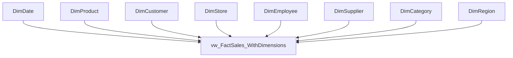

# Power BI Implementation Guide — Enterprise Retail Analytics Platform

> **Audience:** BI Engineer / Analyst building the ShopStar Retail Power BI model on top of the `RetailDW` star schema.
> **Prerequisite:** Phases 1–5 complete (Landing → Staging → Warehouse → Views). The 15 consumption views in [SQL/Views/07_Analytics_Views.sql](../SQL/Views/07_Analytics_Views.sql) are live in the database.
> **Power BI phase order (Standing Rule 5):** 6a Connection → 6b Power Query → 6c Data Modeling → 7 DAX → 8 Dashboards → 9 Deployment.

---

## How to read this guide

Each section maps to a real deliverable step. Beginner-friendly explanations use the **WHAT / WHY / WHEN** frame so you can defend every decision in an interview.

| Section | Power BI Phase | Deliverable |
|---|---|---|
| 1. Connection Strategy | 6a | Choose storage mode + connect to `RetailDW` |
| 2. Power Query Transformations | 6b | Clean, typed, folded queries |
| 3. Data Modeling | 6c | Star schema, relationships, hierarchies |
| 4. Views for Performance | 6c | Pre-aggregated views + aggregation tables |
| 5. Incremental Refresh | 9 | RangeStart/RangeEnd refresh policy |
| 6. Row-Level Security | 9 | 4 levels of RLS/OLS |
| 7. Performance Optimization | 7–9 | Model-size + DAX tuning |

---

## SECTION 1 — CONNECTION STRATEGY (Phase 6a)

### 1.1 Import vs DirectQuery vs Composite

| Mode | WHAT it does | WHEN to use it here | Trade-off |
|---|---|---|---|
| **Import** | Loads a compressed copy of the data into the VertiPaq in-memory engine. | **Default choice** for ShopStar. FactSales ≈ 201K rows, dims are small — easily fits in memory. Fastest visuals, full DAX. | Data is as fresh as the last refresh. |
| **DirectQuery** | Leaves data in SQL Server; every visual sends a live query. | Only if data must be real-time OR the model is too big for memory (billions of rows). Not needed at our volume. | Slower visuals, limited DAX, DB load. |
| **Composite** | Mix: some tables Import, some DirectQuery, plus **aggregation tables**. | Advanced: Import small dims + aggregated views, DirectQuery the huge raw fact only when a user drills to detail. | Most complex to build & govern. |

**Decision for this project:** **Import mode.** WHY: our warehouse is small enough to fit in memory, Import gives the fastest UX and the richest DAX, and the nightly ETL already controls freshness. WHEN we later exceed memory limits, migrate the biggest fact to a **Composite** model (see Section 4).

### 1.2 Connection string to `RetailDW`

In Power BI Desktop: **Home → Get Data → SQL Server**.

```
Server:   localhost           (or your instance, e.g. localhost\SQLEXPRESS)
Database: RetailDW
Data Connectivity mode: Import
```

- **Authentication:** *Windows* (matches how the ETL connects: `sqlcmd -S localhost -E`).
- **Advanced options → SQL statement:** leave blank so **query folding** stays enabled (Section 2.4). Do NOT paste a hand-written SQL query here — select the views from the Navigator instead so the M engine can fold filters.

### 1.3 Which objects to import

Import the **warehouse dimension tables** + the **purpose-built views**, NOT the raw landing/staging tables.

| Import (✅) | Reason |
|---|---|
| `warehouse.DimDate`, `DimProduct`, `DimCustomer`, `DimStore`, `DimEmployee`, `DimSupplier`, `DimCategory`, `DimRegion` | Clean, conformed dimensions with surrogate keys. |
| `warehouse.vw_FactSales_WithDimensions` | Fact grain with keys — the model's central table. |
| `warehouse.vw_SalesMonthly_Aggregated` | Pre-aggregated table for trend visuals (Section 4). |
| `warehouse.vw_ExecutiveKPIs`, `vw_YoY_Comparison`, `vw_CustomerRFM`, `vw_ProductABC`, `vw_InventoryAlerts`, `vw_StorePerformance_KPIs`, `vw_RegionalComparison`, `vw_EmployeeSalesMetrics`, `vw_ShippingPerformance`, `vw_ReturnAnalysis`, `vw_CustomerSegmentation` | Ready-made pages / drill tables. |
| `warehouse.vw_RLS_StoreAccess` | Security bridge table for dynamic RLS (Section 6). |

| Do NOT import (❌) | Reason |
|---|---|
| `landing.*`, `staging.*` | Raw/uncleaned; bloats the model and duplicates the warehouse. |

> **Tip:** Prefer the **view** over the raw fact table where a view exists. The view name documents intent, and centralizing logic in SQL means one fix updates every report.

---

## SECTION 2 — POWER QUERY TRANSFORMATIONS (Phase 6b)

Power Query (the **Transform Data** window) is where you shape each table before it loads. Keep transforms light — the warehouse already did the heavy lifting.

### 2.1 Remove unneeded columns

- Drop audit columns like `_LoadedAt`, `_IsValid` from every table. **WHY:** they add model size and confuse report users; they were only for ETL lineage.
- Drop business/natural keys you will not display (e.g. keep `ProductSK` for relationships, remove duplicate `ProductID` if unused).
- **Rule:** *Remove columns early* (right after Source) so downstream steps and refresh do less work.

### 2.2 Set correct data types

Set types explicitly — never trust auto-detect.

| Column pattern | Correct type |
|---|---|
| `*SK`, `*Key`, `DateKey`, `Quantity`, `ReorderPoint` | **Whole Number** |
| `UnitPrice`, `UnitCost`, `LineTotal`, `GrossProfit`, `RefundAmount` | **Fixed Decimal Number** (currency — avoids floating-point rounding) |
| `MarginPercent`, `DiscountPercent` | **Decimal Number** |
| `FullDate`, `OpenDate`, `JoinDate`, `HireDate` | **Date** |
| `IsWeekend`, `IsLowStock`, `IsOutOfStock` | **True/False** |
| Names, `Segment`, `Channel`, `Reason` | **Text** |

**WHY Fixed Decimal for money:** it stores 4 fixed decimals and prevents the tiny rounding errors that floating **Decimal** introduces when summing 200K rows.

### 2.3 Prepare relationships (don't build them here)

- Ensure each dimension's key column (`ProductSK`, etc.) exists and is a **Whole Number** — integer keys make relationships fast (Section 3.2).
- Do NOT create relationships in Power Query; that happens in **Model view** (Section 3).
- Confirm the fact view exposes every `*SK` foreign key so each dimension can join.

### 2.4 Preserve query folding

**Query folding** = Power Query pushes your steps back to SQL Server as a single SELECT, so the server (not your laptop) does the work.

- **Keep folding:** filtering rows, removing/renaming columns, changing types, grouping. These fold.
- **Breaks folding:** adding index columns, complex custom M functions, merging non-foldable sources. Do these **last**, after all foldable steps.
- **Check it:** right-click the last step → **View Native Query**. If it's available (not greyed out), the step folded. **WHY it matters:** folding is essential for **Incremental Refresh** (Section 5) — the date filter must fold to SQL or refresh scans the whole table.

---

## SECTION 3 — DATA MODELING (Phase 6c)

### 3.1 Build the star schema

Arrange tables in **Model view** as a classic Kimball star: the fact view (`vw_FactSales_WithDimensions`) in the center, dimensions around it.



### 3.2 Relationships: cardinality & cross-filter

Create relationships by dragging each dimension's SK onto the matching SK in the fact.

- **Cardinality:** **One-to-Many (1:*)** — one dimension row → many fact rows. WHAT: DimProduct[ProductSK] (1) → Fact[ProductSK] (*).
- **Cross-filter direction:** **Single** (dimension filters fact). **WHY:** single direction is predictable and fast; avoid **Both** unless a specific many-to-many bridge needs it (it can create ambiguous filter paths).
- **Integer keys only:** relate on `*SK` integer columns, never on text names. Integer joins are dramatically faster in VertiPaq.
- Handle the `-1` "Unknown" member gracefully: online orders have `StoreSK = -1` / `EmployeeSK = -1`. Because a `-1` row exists in each dimension, these join cleanly instead of dropping to a blank.

### 3.3 Hide technical columns

Right-click → **Hide from report view** for anything users shouldn't pick:

- All `*SK` / `*Key` columns (used for relationships, not for display).
- Raw cost columns you expose only via measures.
- Every column on the fact table except the ones needed for ad-hoc drill.

**WHY:** a clean field list guides report authors to the *measures* and *attributes* you intend, reducing wrong-field mistakes.

### 3.4 Display folders

Group measures/columns into **Display folders** (Properties pane → Display folder):

- `Sales \ Revenue`, `Sales \ Profitability`, `Sales \ Volume`
- `Customer \ RFM`, `Inventory \ Stock Health`

**WHY:** turns a long flat list into a navigable tree for report authors.

### 3.5 Mark the Date table

Select **DimDate → Table tools → Mark as Date Table**, choosing `FullDate` as the date column.

**WHY:** unlocks correct **Time Intelligence** DAX (`TOTALYTD`, `SAMEPERIODLASTYEAR`, `DATEADD`). Without marking, these functions can silently return wrong results. `DimDate` already has a contiguous daily range (2020–2026), which the mark requires.

### 3.6 Hierarchies

Create drill-down hierarchies (right-click column → **Create hierarchy**):

- **Date hierarchy** on `DimDate`: **Year → Quarter → Month → Day**
  (`Year` → `QuarterName` → `MonthName` → `DayOfMonth`; sort `MonthName` by `MonthNumber`).
- **Geography hierarchy** on `DimStore`: **Region → State → City**.

**WHY:** lets users drill in a single visual (Year → down to Day) without dragging four separate fields. Always set **Sort by column** (e.g. MonthName sorted by MonthNumber) so months order Jan→Dec, not alphabetically.

---

## SECTION 4 — VIEWS FOR PERFORMANCE (Phase 6c)

### 4.1 Pre-aggregated views

Import `vw_SalesMonthly_Aggregated` alongside the detailed fact. **WHAT:** it rolls FactSales up to month × dimension grain in SQL. **WHY:** a monthly trend visual reads a few thousand pre-summed rows instead of scanning 201K fact rows on every interaction.

### 4.2 Aggregation-table pattern

Power BI's **Manage aggregations** feature lets a summary table transparently answer high-level queries while the detail table answers drill-downs.

1. Import the detail fact (DirectQuery in a composite model) **and** the aggregated view (Import).
2. **Model view → right-click the agg table → Manage aggregations.**
3. Map agg columns to detail: `SUM(LineTotal)` → detail `LineTotal`, `Count` → table rows, group-by → `DateKey`, `ProductSK`, etc.
4. Set **Precedence** so the agg table is tried first.

**Result:** a "Revenue by Month" visual hits the tiny agg table (fast); a "show me the order lines" drill falls through to detail — automatically, no report change.

### 4.3 Composite model tie-in

The aggregation pattern **requires** a Composite model: detail fact in **DirectQuery** + agg view in **Import**. WHEN to adopt: only after Import-everything stops fitting in memory. Until then, plain Import + the monthly view (4.1) is simpler and enough.

---

## SECTION 5 — INCREMENTAL REFRESH (Phase 9)

Incremental refresh reloads only *recent* data each night instead of the whole fact, cutting refresh time and DB load.

### 5.1 RangeStart / RangeEnd parameters

1. **Transform Data → Manage Parameters → New.** Create two **Date/Time** parameters named **exactly** `RangeStart` and `RangeEnd` (reserved names).
2. Give them any placeholder values (e.g. 2023-01-01 and 2024-01-01).

### 5.2 Filter the fact by date

On the fact query, filter the date column **between** the parameters:

```
Keep Rows where  OrderDate >= RangeStart  AND  OrderDate < RangeEnd
```

- Use a real **date/datetime** column. `vw_SalesDaily_ForIncremental` exists specifically to expose a clean daily date column that folds to SQL for this filter.
- **This filter MUST fold** (View Native Query). If it doesn't fold, refresh scans everything and the feature is pointless.

### 5.3 Refresh policy

Right-click the fact table → **Incremental refresh** → turn on:

- **Store rows in the last:** `3 Years` (archive window kept in the model).
- **Refresh rows in the last:** `30 Days` (only this recent slice is re-queried nightly; older partitions stay cached).
- Optionally enable *"Detect data changes"* and *"Only refresh complete periods."*

**WHY:** old months rarely change; re-reading 3 years every night wastes time. Refreshing the last 30 days keeps recent corrections current while partitioning history.

### 5.4 Publish to the Service

- Publish the `.pbix` to a **Power BI Service** workspace.
- On **first refresh in the Service**, Power BI creates the historical partitions (this run is longer); subsequent scheduled refreshes only touch the 30-day window.
- Configure the **On-premises Data Gateway** so the Service can reach `localhost / RetailDW`.
- Set a **scheduled refresh** (e.g. daily 6 AM, after the ETL finishes).

> Incremental refresh partitions are created **only** in the Service, not in Desktop.

---

## SECTION 6 — ROW-LEVEL SECURITY (Phase 9)

RLS restricts which **rows** a user sees; OLS restricts which **columns/objects** they see. Define roles in **Modeling → Manage roles**, test with **View as**.

### Level 1 — Static RLS (simplest)

Hard-code a filter per role.

- **Role "East Region":** table `DimStore`, DAX filter:
  ```DAX
  [Region] = "East"
  ```
- Members assigned to this role only ever see East stores (and, via the relationship, only East fact rows).

**WHEN:** a few fixed regional roles. **Downside:** one role per region to maintain.

### Level 2 — Dynamic RLS (scalable)

One role, filtered by *who is logged in*.

- Requires a mapping table (`vw_RLS_StoreAccess`: UserEmail → allowed Region/Store).
- **Role "Dynamic Store Access":** on the mapping table:
  ```DAX
  [UserEmail] = USERPRINCIPALNAME()
  ```
- Or resolve the current user's region and filter a dimension:
  ```DAX
  DimStore[Region] =
      LOOKUPVALUE(
          vw_RLS_StoreAccess[Region],
          vw_RLS_StoreAccess[UserEmail], USERPRINCIPALNAME()
      )
  ```

**WHY:** add a user by inserting one row in the mapping view — no model change, no new role. `USERPRINCIPALNAME()` returns the signed-in user's UPN in the Service.

### Level 3 — Object-Level Security (hide columns)

RLS hides rows; **OLS** hides whole columns/tables.

- Hide sensitive financials — `UnitCost`, `LineCOGS` — from a **SalesTeam** role.
- OLS isn't in Desktop's UI; apply it with **Tabular Editor**: select the column → **Object Level Security** → set the role to *None*.
- **Result:** the SalesTeam role cannot see, query, or even discover those columns; visuals using them break gracefully for that role only.

**WHEN:** margin/cost data must stay hidden from field reps who can still see revenue.

### Level 4 — Hierarchical RLS (org chart)

A manager should see their own sales **and everyone below them**.

- `DimEmployee` has `ManagerID` (self-referencing). Materialize an **OrgPath** column using a path string (built via the recursive-CTE org chart in [SQL/Practice/SQL_100_Queries_Portfolio.sql](../SQL/Practice/SQL_100_Queries_Portfolio.sql) Q57), e.g. `1|5|17|42`.
- **Role "Manager Hierarchy":** on `DimEmployee`:
  ```DAX
  VAR CurrentEmpPath =
      LOOKUPVALUE(
          DimEmployee[OrgPath],
          DimEmployee[Email], USERPRINCIPALNAME()
      )
  RETURN
      PATHCONTAINS( DimEmployee[OrgPath], CurrentEmpPath )
  ```
  (Using DAX `PATH()` / `PATHCONTAINS()` on the parent-child hierarchy.)

**WHY:** one rule gives every manager exactly their subtree — no per-manager roles.

### Testing RLS

- **Desktop:** Modeling → **View as** → tick a role (and optionally enter a UPN for dynamic roles) to preview exactly what that user sees.
- **Service:** workspace → dataset → **Security** → assign users/groups to roles; use **Test as role**.
- Always verify totals shrink as expected and that cross-filtering doesn't leak rows through a Both-direction relationship.

---

## SECTION 7 — PERFORMANCE OPTIMIZATION (Phases 7–9)

### 7.1 Reduce model size

- Remove unused columns (especially high-cardinality text and audit columns) — VertiPaq compresses fewer, lower-cardinality columns far better.
- Prefer **measures** over calculated columns; measures compute at query time and cost no storage.
- Split high-cardinality datetime into a date key + a time table if second-level detail isn't needed.

### 7.2 Integer keys

Relate tables on the integer `*SK` surrogate keys, never on text. Integer relationships scan and hash faster and compress better than string keys.

### 7.3 Aggregation tables & pre-aggregated views

Use `vw_SalesMonthly_Aggregated` and the **Manage aggregations** pattern (Section 4) so summary visuals never scan the full grain.

### 7.4 Columnstore on the warehouse

Ensure the underlying `FactSales` uses a **clustered columnstore index** in SQL Server. WHY: DirectQuery/refresh queries against a columnstore fact are ordersof-magnitude faster for the aggregate scans Power BI issues.

### 7.5 Query folding

Re-check (Section 2.4) that filters/removes fold to SQL. Folding = server does the work, smaller data crosses the wire, and Incremental Refresh works.

### 7.6 DAX variables

Use `VAR` to compute a value once and reuse it, instead of repeating an expression:

```DAX
Profit Margin % =
VAR TotalRevenue = SUM ( FactSales[LineTotal] )
VAR TotalProfit  = SUM ( FactSales[GrossProfit] )
RETURN
    DIVIDE ( TotalProfit, TotalRevenue )
```

**WHY:** variables evaluate once (faster, readable), and `DIVIDE()` safely handles divide-by-zero. Avoid repeated `SUM()` calls and naked `/` division in measures.

---

## Next steps

| Phase | File / Deliverable |
|---|---|
| 7 DAX | Measures library (`Measures.dax`) built on this model |
| 8 Dashboards | Executive, Sales, Inventory, Customer report pages |
| 9 Deployment | Incremental refresh + RLS applied in the Service |

Practice the SQL that powers these views with [SQL/Practice/SQL_Practice_Guide.md](../SQL/Practice/SQL_Practice_Guide.md).
